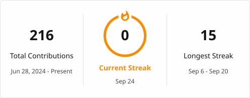

<h1 align="center">Waleed Ahmed Ismail</h1>
<h3 align="center">Java Backend Developer — Spring Boot | REST APIs | SQL</h3>

  

  <a href="mailto:walidahmedismail21@gmail.com">Email</a> ·
  <a href="https://linkedin.com/in/walid-ahmed-a79951370">LinkedIn</a> ·
  <a href="https://github.com/WalidAhmed89">GitHub</a>

---

### About

Backend developer focused on building reliable, well-structured systems in Java. My work centers on clean object-oriented design, relational data modeling, and translating real business rules into working software — most recently a full building maintenance management system built solo, and a gym membership platform with layered business logic in Java and SQLite.

Currently deepening my backend stack with Spring Boot, Spring Data JPA, and Spring Security, with Docker and cloud deployment next on the list. Studying Artificial Intelligence at Helwan University, which shapes how I approach system design — starting from the data model and working outward.

---

### Technical Focus

**Languages & Core**
Java · SQL · Object-Oriented Design · Data Structures & Algorithms

**Backend & Data**
Spring Boot · Spring Data JPA · Hibernate · JDBC · Oracle SQL

**In Progress**
Spring Security · Docker · Microservices · AWS

---

### Selected Projects

**Building Maintenance Management System**
Full-scale management system covering maintenance requests, scheduling, and resource tracking. Originally scoped as a team assignment; completed independently, covering the full backend design and implementation.

**HeroGym**
Gym membership management system in Java with JDBC and SQLite, enforcing membership and billing business rules through a layered OOP design.

**FrostedOS**
Python-based OS simulator built with a team. Owned the backend shared-state architecture and the Process Management module, with contributions to Memory Management and the File System.

---

### Currently

Looking to collaborate on backend and Spring Boot projects, and open to conversations on system design, microservices, and cloud deployment.

---

  <a href="mailto:walidahmedismail21@gmail.com">walidahmedismail21@gmail.com</a>

<h3 align="left">Connect with me:</h3>

<h3 align="left">Languages and Tools:</h3>

             

  

